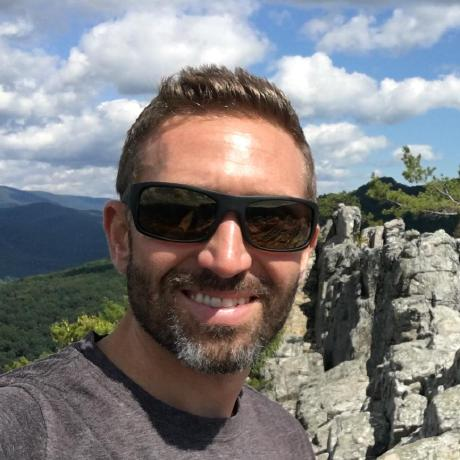
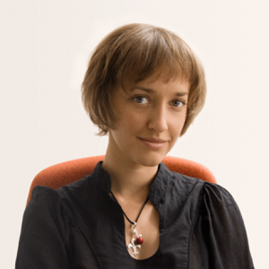
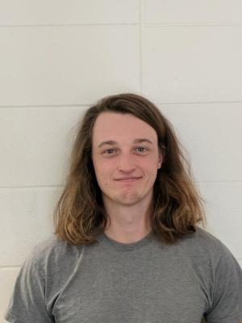
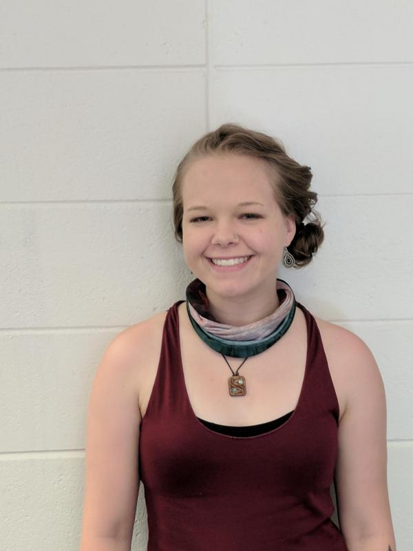
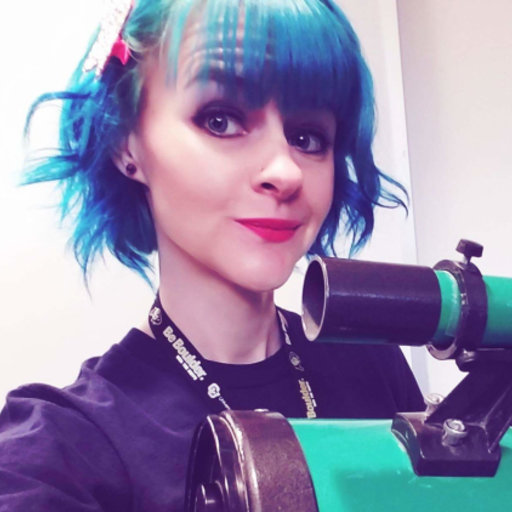

The <u>E</u>xploration of <u>P</u>lanetary <u>I</u>ces and <u>C</u>limates
(EPIC) group in the Laboratory for Atmospheric and Space Physics
(<a href="https://lasp.colorado.edu" target="\_">LASP</a>)
at CU Boulder investigates the atmospheres and surfaces of icy
worlds using numerical models and data from spacecraft and ground-based
observatories. We are especially interested in the thermal environments and
behavior of volatiles on these bodies, particularly in their polar regions.
Our quantitative approach includes the development of numerical heat, vapor,
and radiative transfer models with wide applicability to problems in planetary
science. Data analysis efforts focus on multi-spectral and hyper-spectral
imaging for compositional studies, thermal infrared atmospheric sounding and
surface mapping, and inversion techniques.

Our group is composed of researchers at all levels, from undergraduates to
postdoctoral scholars. We welcome <a href="mailto:Paul.Hayne@Colorado.edu">
inquiries</a> for possible opportunities from
individuals representing a diverse range of backgrounds. The EPIC group is a
welcoming environment, where diverse perspectives are respected and everyone is
valued for their contributions.

<h4>Group Members:</h4>

<table border="0" cellspacing="0" cellpadding="0">
<tr><td colspan="2">Faculty and Researchers:</td></tr>
<tr>
  <td>
<b>Paul Hayne</b>
</td>
  <td>Dr. Paul Hayne is an assistant professor in the department of Astrophysical & Planetary Sciences, and LASP. He grew up near Seattle, Washington. Paul joined the CU faculty in January, 2018, after serving for five years as a research scientist at NASA’s Jet Propulsion Laboratory in Pasadena, CA. Paul earned his bachelor’s and master’s degrees at Stanford University, and his PhD at UCLA (with David Paige). He did his postdoc at Caltech (with Oded Aharonson), where he developed numerical models for investigating the behavior of volatiles on the Moon and Ceres.</td>
</tr>
<tr>
  <td>
<b>Ganna (Anya) Portyankina</b>
</td>
  <td>Dr. Anya Portyankina is a LASP Research Associate, whose research focuses on the behavior of CO2 frosts on Mars.</td>
</tr>
<tr>
  <td>
<b>Michael Aye</b>
</td>
  <td>Dr. Michael Aye is a LASP Research Associate, whose research focuses on innovative data analysis techniques and instrumentation for studying Mars, the Moon, and Saturn's rings.</td>
</tr>
<tr>
  <td>
<b>Margaret Landis</b>
</td>
  <td>Dr. Margaret Landis is a LASP Research Associate, who joined the EPIC group in 2019. Her research focuses on the nature and distribution of ice in the inner solar system.</td>
</tr>
<tr><td colspan="2">Graduate Students:</td></tr>
<tr>
  <td>
<b>Andrew Wilcoski</b>
</td>
  <td>Andrew Wilcoski is a PhD student in the department of Astrophysical and Planetary Sciences. His research is on numerical modeling of the mass balance and evolution of the residual polar ice caps of Mars.</td>
</tr>
<tr>
  <td>
<b>Raven Larson</b>
</td>
  <td>Raven Larson is a PhD student in the department of Astrophysical and Planetary Sciences. Her research is on detecting and interpreting impact flashes on the Moon.</td>
</tr>
<tr><td colspan="2">Undergraduate Students:</td></tr>
<tr>
  <td>
<b>Carlos Eytan Gary Bicas</b>
</td>
  <td>Carlos hails from Mexico City. He moved to Colorado to pursue a career in planetary science. He is a senior who will soon graduate from the University of Colorado with a degree in Astronomy. He is currently working at looking at Mars’ polar snowfall to figure out how Mars’ climate might be controlled by the South Polar Residual Cap (SPRC).</td>
</tr>
<tr>
  <td>
<b>Tyler Horvath</b>
</td>
  <td>Tyler Horvath is an undergraduate researcher, who develops models to simulate thermal conditions inside lunar pits and caves.</td>
</tr>
<tr>
  <td>
<b>Tara Tomlinson</b>
</td>
  <td>Tara Tomlinson is an undergraduate researcher, whose research focuses on impact craters on Europa.</td>
</tr>
</table>
